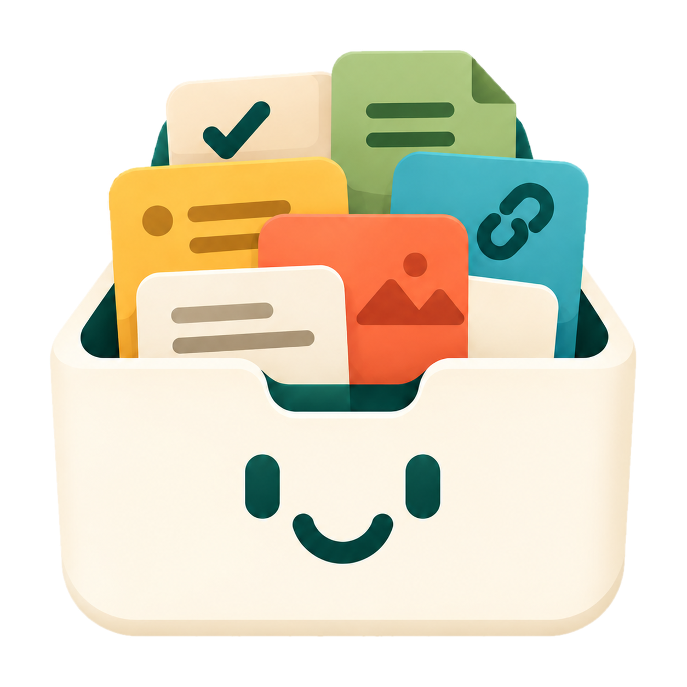
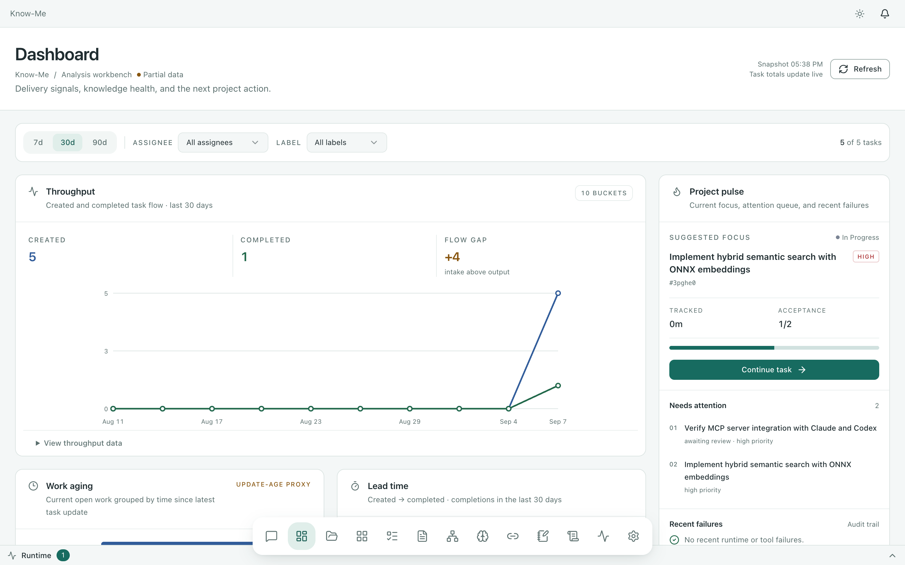
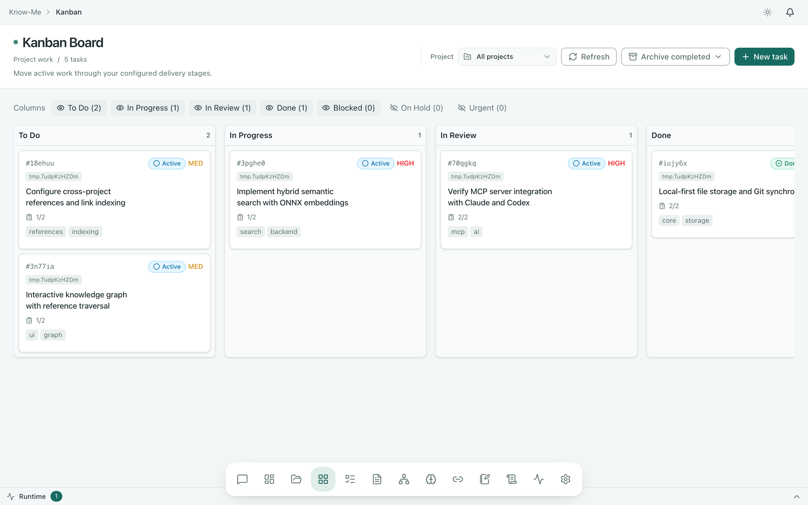
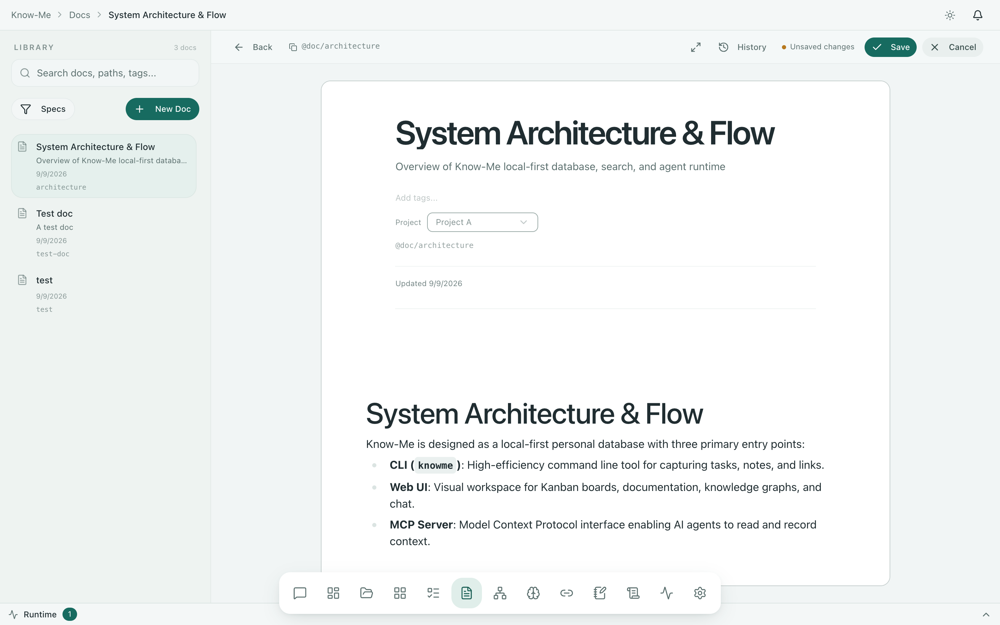
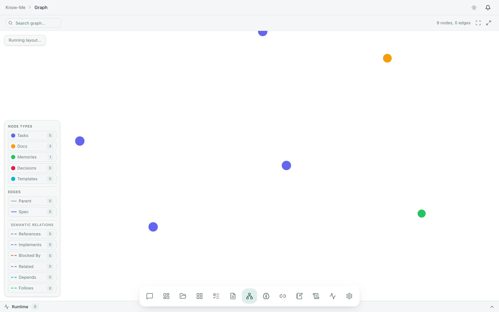

<p align="center">
  
</p>

<h1 align="center">Know-Me</h1>

<p align="center">
  <strong>Stop re-explaining your project to AI coding agents.</strong>
</p>

<p align="center">
  <sub>Local-first memory layer · Tasks · Docs · Decisions · Git-friendly · MCP</sub>
</p>

<p align="center">
  <a href="https://github.com/hoangtrung1801/know-me/actions/workflows/ci.yml"></a>
  <a href="https://github.com/hoangtrung1801/know-me/releases"></a>
  <a href="./LICENSE"></a>
  
  <a href="https://www.npmjs.com/package/@hoangtrung1801/knowme"></a>
</p>

<p align="center">
  <a href="./docs/en/README.md">Documentation</a> ·
  <a href="./README.vi.md">Tiếng Việt</a> ·
  <a href="./README.zh-CN.md">简体中文</a>
</p>

---

**Know-Me** is a local-first memory layer for AI-assisted software projects.
Keep tasks, docs, decisions, and project context in files your team and AI
agents can actually inspect.

The product is called **Know-Me**. The command-line interface is `knowme`.

<p align="center">
  
</p>

## What you keep in Know-Me

| Resource               | What it holds                                                                         |
| ---------------------- | ------------------------------------------------------------------------------------- |
| **Projects**           | Centralized home per project; every task, doc, and decision links back to one         |
| **Tasks & Kanban**     | Planned work with status, acceptance criteria, notes; `board` renders the Kanban view |
| **Documents**          | Durable project knowledge — specs, architecture, onboarding, journals                 |
| **Memos**              | Fast global notes and captures, no project required                                   |
| **Links**              | Saved URLs with metadata for reading later or referencing from tasks/docs             |
| **Memory & Decisions** | Reusable conventions plus recorded system decisions with evidence                     |

Everything is human-readable on disk (Markdown + JSON), versionable with Git,
and searchable from any interface. See [Philosophy](./PHILOSOPHY.md) for why.

## Collect with AI, search with context

AI is a collection and recall assistant, not a black box:

- **Collect** — capture a memo, link, task, or doc from the CLI, Web UI, or an agent; Know-Me files it in the right place.
- **Search** — keyword, hybrid, semantic, and reference-aware lookup across tasks, docs, memories, and decisions.
- **Enrich** — `retrieve` pulls ranked context for the thing you're working on, so agents and humans see surrounding decisions, docs, and code references instead of guessing.

Nothing important lives only in chat history. If it's worth keeping, it goes
in project memory with a reference (`@doc/<path>`, `@task/<id>`) that resolves
to the exact source every time.

## How it works

One Go application, three entry points over the same storage and domain services:

- **CLI** — scriptable capture and management (`task`, `doc`, `memo`, `link`, `board`, `search`).
- **Web UI** — local browser workspace for Kanban boards, docs, graphs, and chat workflows.
- **MCP server + skills** — agents connect straight to your project memory layer via structured MCP tools and skills (see below).

Storage layout:

- `<repo>/.know-me/` — project memory: tasks, docs, decisions, memories (Markdown + JSON, Git-friendly).
- `~/.know-me/` — global workspace: project registry, saved links, memos, global memory.
- Search indexes are derived and rebuildable; delete them any time.

## Visual Workspace

Know-Me includes a built-in, local-first Web UI (`knowme browser --open` or `http://localhost:6421`):

<p align="center">
  
</p>

- **Kanban Board** — Interactive delivery stages (`To Do`, `In Progress`, `In Review`, `Done`), acceptance criteria checklists, priority badges, and project filters.

<p align="center">
  
</p>

- **Documentation & Specs** — Markdown knowledge base with structured metadata, tags, project assignment, and cross-references.

<p align="center">
  
</p>

- **Knowledge Graph** — Interactive visualization mapping connections across tasks, documents, decisions, and memories.

## Quick start

```bash
cd your-project
knowme init
```

```bash
# Capture fleeting notes and links — no project ceremony needed
knowme memo add "Idea: weekly review every Friday"
knowme link add https://example.com/article

# Manage a project: tasks on a Kanban board
knowme task create "Set up the release" -d "Prepare the first release checklist"
knowme board

# Record durable knowledge
knowme doc create "Architecture" -d "System overview" -f architecture

# Search everything, then validate the database
knowme search "release" --plain
knowme retrieve "release" --json
knowme validate --plain

# Open the visual workspace
knowme browser --open
```

## Connect an AI agent

Agents read and write the same project memory you use — via MCP tools and
skills, not copy-pasted chat logs:

```bash
# User-level setup for a platform
knowme setup codex --global
knowme setup claude --global

# Repository-local compatibility guidance
knowme setup agents
```

At the start of an AI session, the MCP server exposes `initial` for project
operating context. Use `help` when an agent needs detailed tool schemas. Run
`knowme sync` after changing platform configuration or updating the CLI.

See the [AI Workflow](./docs/en/guides/ai-workflow.md) and
[MCP integration guide](./docs/en/guides/mcp-integration.md).

## Installation

### npm

```bash
npm install -g @hoangtrung1801/knowme
```

### Shell installer (macOS / Linux)

```bash
curl -fsSL https://raw.githubusercontent.com/hoangtrung1801/know-me/main/install/install.sh | sh
```

### PowerShell installer (Windows)

```powershell
irm https://raw.githubusercontent.com/hoangtrung1801/know-me/main/install/install.ps1 | iex
```

### From source

Requires Go 1.24.2 or later:

```bash
git clone https://github.com/hoangtrung1801/know-me.git
cd know-me
make all
./bin/knowme --version
```

Verify any installation with:

```bash
knowme --version
```

## Common commands

| Command               | Purpose                                             |
| --------------------- | --------------------------------------------------- |
| `knowme init`         | Initialize or register a project                    |
| `knowme task ...`     | Create and manage planned work                      |
| `knowme board`        | Show the Kanban board                               |
| `knowme doc ...`      | Create and manage project documentation             |
| `knowme memo ...`     | Capture and list fast global notes                  |
| `knowme link ...`     | Save and list links for later                       |
| `knowme memory ...`   | Store reusable project or global context            |
| `knowme decision ...` | Record and review system decisions                  |
| `knowme search ...`   | Search tasks, docs, memories, and decisions         |
| `knowme retrieve ...` | Retrieve ranked context for an AI workflow          |
| `knowme code ...`     | Inspect indexed symbols and dependencies            |
| `knowme validate`     | Check project structure and configuration           |
| `knowme browser`      | Start or open the local Web UI                      |
| `knowme setup ...`    | Configure agent platforms and integrations          |
| `knowme sync`         | Apply project configuration and generated artifacts |

`knowme [command] --help` shows command-specific options. Most commands
support `--plain` for automation-friendly output and `--json` for structured
output.

Full reference: [Commands](./docs/en/reference/commands.md).

## Documentation

- [Documentation index](./docs/en/README.md)
- [Installation](./docs/en/getting-started/installation.md)
- [Quick start](./docs/en/getting-started/quick-start.md)
- [User guide](./docs/en/guides/user-guide.md)
- [Task management](./docs/en/guides/task-management.md)
- [Web UI](./docs/en/guides/web-ui.md)
- [MCP integration](./docs/en/guides/mcp-integration.md)
- [Command reference](./docs/en/reference/commands.md)
- [Configuration](./docs/en/reference/configuration.md)
- [Reference system](./docs/en/reference/reference-system.md)
- [Architecture](./ARCHITECTURE.md)
- [Philosophy](./PHILOSOPHY.md)
- [Contributing](./CONTRIBUTING.md)
- [Changelog](./CHANGELOG.md)

## Development

Requirements:

- Go 1.24.2 or later
- Bun for UI development and builds
- Docker for runtime and stress-test targets

```bash
make all             # Build the UI and CLI
make build           # Build the current-platform CLI
make test            # Go test suite with the race detector
make lint            # golangci-lint
make test-e2e        # CLI and MCP end-to-end tests
make test-e2e-ui     # UI end-to-end tests
make dev-go          # Go server with hot reload
make dev-ui          # Vite UI development server
```

Start with [Contributing](./CONTRIBUTING.md)
and [Architecture](./ARCHITECTURE.md). Contributions follow
[CONTRIBUTING.md](./CONTRIBUTING.md) under the MIT license.

## Links

- [GitHub](https://github.com/hoangtrung1801/know-me)
- [npm](https://www.npmjs.com/package/@hoangtrung1801/knowme)
- [Discord](https://discord.knowns.dev)
- [Releases](https://github.com/hoangtrung1801/know-me/releases)
