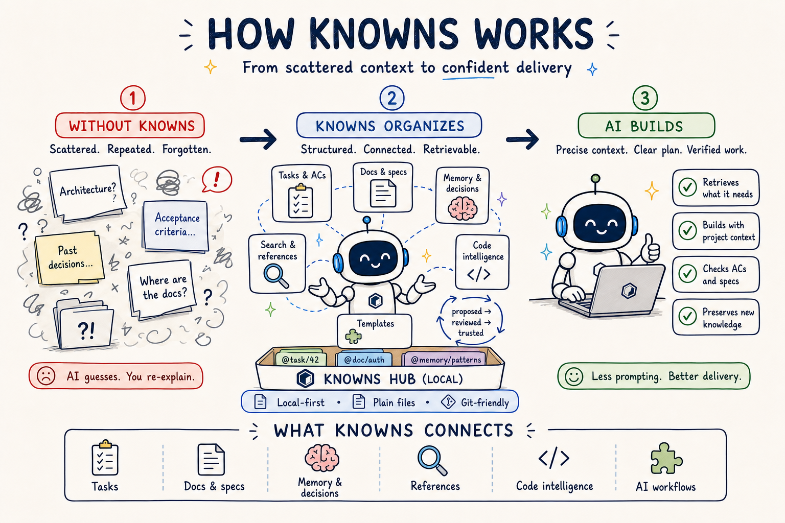

<p align="center">
  
</p>

<h1 align="center">Know-Me</h1>

<p align="center">
  <strong>面向项目、任务、已保存链接和快速备忘的本地优先工作空间。</strong>
</p>

<p align="center">
  <sub>本地优先 · 支持自托管 · 为日常工作节奏而生</sub>
</p>

<p align="center">
  <a href="https://knowns.sh">主页</a> |
  <a href="./README.md">English</a> |
  <a href="./README.vi.md">Tiếng Việt</a> |
  <a href="./docs/README.md">文档</a>
</p>

---

工作容易开始，却很难一直保持井然有序。项目在一个地方，任务在另一个地方，有用的链接消失在浏览器标签页里，快速笔记也会淹没在聊天记录中。

**Know-Me 把它们集中到一起。** 在本地整理工作，从任何项目回到工作上下文，并在合适的时候使用 CLI 或 Web UI。

> **为眼前的工作，以及那些不想忘记的事情，提供一个平静的归处。**

## 目录

- [为什么使用 Know-Me](#为什么使用-know-me)
- [使用 Know-Me 前后](#使用-know-me-前后)
- [Know-Me 是什么](#know-me-是什么)
- [工作方式](#工作方式)
- [核心能力](#核心能力)
- [快速开始](#快速开始)
- [安装](#安装)
- [文档](#文档)
- [开发](#开发)
- [链接](#链接)

## 为什么使用 Know-Me

你的工作应该容易找到，也容易继续。

- 规划项目，同时避免遗漏相关任务。
- 在有用的 URL 淹没在打开的标签页之前将它保存下来。
- 记录快速想法，而不必把它变成一份完整文档。
- 保持工作空间本地优先，并始终由你掌控。

## 使用 Know-Me 前后

| 没有 Know-Me | 使用 Know-Me |
|---|---|
| 任务散落在笔记和聊天记录中 | 项目集中管理相关任务 |
| 有用的页面变成被遗忘的书签 | 已保存链接组成一个可搜索的公共库 |
| 快速想法在行动前就消失了 | 备忘在几秒内将它们保存下来 |
| 重建工作上下文需要花费时间 | 回来时工作空间已经准备就绪 |

## Know-Me 是什么

Know-Me 是一个**本地优先、支持自托管的生产力工作空间**。它帮助你组织项目和任务、保存有用的链接、记录快速笔记，同时不放弃对数据的控制。

项目为相关工作提供归处。已保存链接和备忘是全局的，因此在每个项目中都可以使用。

<p align="center">
  
</p>

## 工作方式

1. **创建项目**，组织相关工作。
2. **跟踪任务**及其在项目中的进度。
3. **保存链接和备忘**，留住任何值得保留的内容。
4. **通过 CLI 或 Web UI 回到工作空间**。

记录简单。优先级清晰。更少丢失工作上下文。

## 核心能力

| 🗂️ 项目 | ✅ 任务 | 🔗 已保存链接 | ✍️ 备忘 |
|---|---|---|---|
| 为相关工作提供归处。 | 将想法变成清晰的下一步。 | 将有用的 URL 保存在一个全局库中。 | 在想法消失前把它记下来。 |

### 试试看

```bash
# 开始一个项目工作空间
knowme init

# 添加一个任务
knowme task create "规划发布" --ac "确定第一个里程碑"

# 保存有用的信息
knowme link add "https://example.com/article"
knowme memo add "询问 Sam 关于发布计划的时间安排"
```

## 快速开始

第一次使用只需五个小步骤：

1. 安装 Know-Me。
2. 创建或注册项目工作空间。
3. 添加一个想要完成的任务。
4. 保存一个有用的链接和一条快速备忘。
5. 在浏览器中打开工作空间。

```bash
# 安装
brew install knowns-dev/tap/knowns
# 或：npm install -g knowns
# 或：curl -fsSL https://knowns.sh/script/install | sh

# 创建或注册项目工作空间
mkdir my-project
cd my-project
knowme init

# 为项目添加工作
knowme task create "选择发布日期" --ac "确认日期"

# 保存以后有用的信息
knowme link add "https://example.com/launch-checklist"
knowme memo add "周五查看清单"

# 在浏览器中打开工作空间
knowme browser --open
```

## 安装

### Homebrew（macOS/Linux）

```bash
brew install knowns-dev/tap/knowns
```

### Shell 安装程序（macOS/Linux）

```bash
curl -fsSL https://knowns.sh/script/install | sh
```

### PowerShell 安装程序（Windows）

```powershell
irm https://knowns.sh/script/install.ps1 | iex
```

### npm

```bash
npm install -g knowns
```

### 从源代码安装

需要 Go 1.24.2 或更高版本。

```bash
go install github.com/hoangtrung1801/know-me/cmd/knowme@latest
```

## 文档

| 指南 | 说明 |
|---|---|
| [用户指南](./docs/en/guides/user-guide.md) | 入门和日常使用 |
| [命令参考](./docs/en/reference/commands.md) | CLI 命令和示例 |
| [Web UI](./docs/en/guides/web-ui.md) | 工作空间、看板、链接和备忘 |
| [配置](./docs/en/reference/configuration.md) | 项目设置和选项 |
| [贡献指南](./CONTRIBUTING.md) | 为 Know-Me 贡献代码 |

## 开发

需要 Go 1.24.2 或更高版本；如需开发 UI，还可选用 Node.js 和 pnpm。

```bash
make build
make test
make test-e2e
make lint
make ui
```

## 链接

- [主页](https://knowns.sh)
- [npm](https://www.npmjs.com/package/knowns)
- [GitHub](https://github.com/hoangtrung1801/know-me)
- [Discord](https://discord.knowns.dev)
- [发布版本](https://github.com/hoangtrung1801/know-me/releases)
